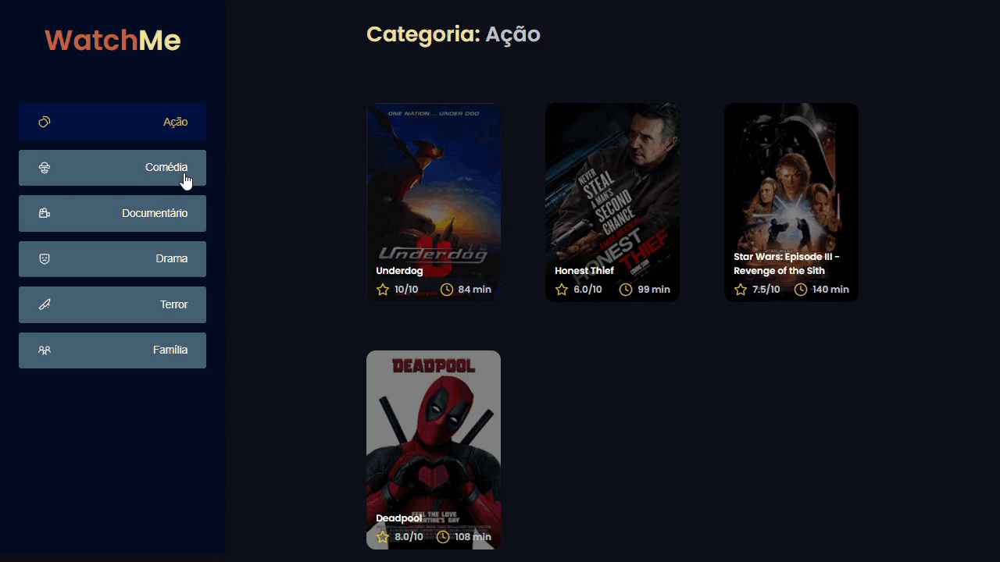

<h1 align="center">Watch  Me</h1>
<h2 align="center">Front end application 🖥️</h2>

<h3 align="center">This application was one of the challenges of Ignite's ReactJS Track delivered by <a href="https://app.rocketseat.com.br/">Rocketseat</a>.</h3>

<h1>Demonstration</h1>
<figure>
  
</figure>

  
  
<h2>Objectives<h2>
  
The main objective of this challenge was to refactor a page for listing films according to genre.

  
To solve this in the best way, the application was componentized in at least two main parts: sidebar and the main content that has the header and the list of films.

  
<h2>Main requirements of the challenge</h2>
  <ul>
    <li>The application has only one main feature, which is the listing of films</li>

  </ul>
  
<h2>Application installation</h2>
  <ul>
    <li><code>git clone https://github.com/luanjesus/desafio02-ingnite-componentizacao.git</code></li> to clone the repository.
  </ul>
  
<h2>Run application</h2>

To run the application, follow the instructions from your terminal:

<ul>
<li><code>cd desafio02-ingnite-componentizacao</code> and <code>code .</code></li>
<li>run <code>yarn</code> to install all project's dependencies</li>
<li><code>yarn server</code>to start the Fake API server with <code>JSON Server</code>, will open at the address <code>localhost:3333</code></li>
<li>run <code>yarn dev</code> to start the application, will open at the address <code>localhost:8080</code></li>
</ul>  
  <h2>Technologies used</h2>
  

    
    
    
    
    
  

  
